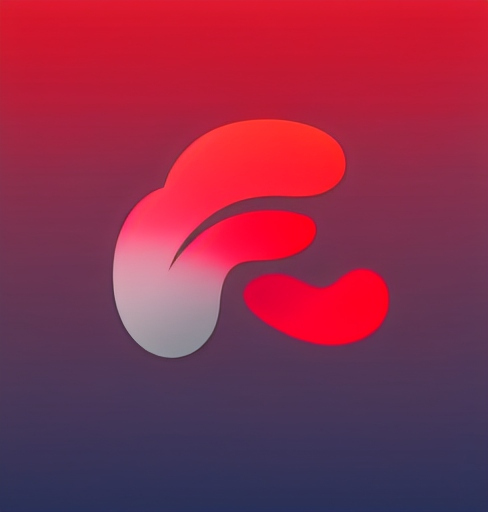

# FLOW 

A client-sided mock social media site to share polls.  

Created by
- Vedant Trivedi
- Om Sathe
- Andrew Clegg
- Sahil Bilai
- David Kelly
  
# HOW TO RUN PROJECT
1. Clone this repository on your computer.
2. From the root folder, navigate to the second flow folder.
3. Install dependencies and run project from here.
```bash
git clone https://github.com/vednat123/flow.git
cd flow  # This is the root directory  
cd flow  # This is the second flow folder, storing app files
npm install
npm run dev
```
This should host the server on this address which will then 
http://localhost:5173/

# MISCELLANEOUS
This app uses a private API key for demonstration purposes. External API functionalities may not always be available.
